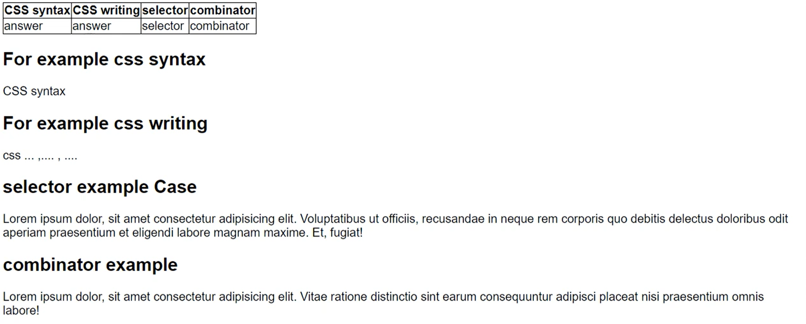

# Homework 2.CSS

1.  slide 5 (review CSS) ให้สร้าง review.html แสดงเป็นตาราง 

    1.1 CSS syntax ประกอบด้วยอะไรบ้าง 

    1.2 การเขียน CSS มีกี่แบบอะไรบ้าง

    1.3 selector มีกี่แบบอะไรบ้าง

    1.4 combinator มีกี่แบบอะไรบ้าง

    

**Answer Item 1** - [Link](1review.html)

    1.1 For example of CSS Syntax

        p {
            color: red;
            text-align: center;
        }

    1.2 For example of CSS Writing

        1.2.1   Inline CSS

            <h1 style="color:blue;">A Blue Heading</h1>

            
A red paragraph.

        1.2.2   Internal CSS

            <!DOCTYPE html>
            <html>
            <head>
            
            </head>
            <body>

            <h1>This is a heading</h1>
            
This is a paragraph.

            </body>
            </html>

        1.2.3 External CSS

            <!DOCTYPE html>
            <html>
            <head>
                <link rel="stylesheet" href="styles.css">
            </head>
            <body>

            <h1>This is a heading</h1>
            
This is a paragraph.

            </body>
            </html>

    1.3 Selector Example Case

        1.3.1   The CSS element Selector
            
            p {
                text-align: center;
                color: red;
            }

        1.3.2   The CSS id Selector

            #para1 {
                text-align: center;
                color: red;
            }

        1.3.3   The CSS class Selector

            .center {
                text-align: center;
                color: red;
            }

        1.3.4   The CSS Universal Selector

            * {
                text-align: center;
                color: blue;
            }

        1.3.5   The CSS Grouping Selector

            h1, h2, p {
                text-align: center;
                color: red;
            }

    1.4 Combinator Example

        1.4.1   Descendant Selector

            div p {
                background-color: yellow;
            }

        1.4.2   Child Selector

            div > p {
                background-color: yellow;
            }

        1.4.3   Adjacent Sibling Selector

            div + p {
                background-color: yellow;
            }

        1.4.4   General Sibling Selector

            div ~ p {
                background-color: yellow;
            }

---

2.  Slide 7 (review CSS)

    2.1 property และ value คืออะไรแตกต่างกันอย่างไร
    
    2.2 property ที่สอนใน precamp มีกี่กลุ่มอะไรบ้าง
    
    2.3 value unit มีกี่ประเภทอะไรบ้างแต่ละ ประเภทคืออะไร

    

**Answer Item 2**

    2.1 Property คือ คุณสมบัติ
        Value คือ ค่าที่กำหนด

    2.2 Property ที่สอนใน Pre-Camp มี 5 กลุ่ม
        -   Property for content: color , size , font , text, list-style-type, Height, Width, background
        -   Property for border : border, table
        -   Property for padding : padding (top right buttom left)
        -   Property for margin : margin (top right buttom left)
        -   Property for element : display, Height, Width, Position, Float, Align, Flex, Grid

    2.3 Value unit มี 2 ประเภท คือ
        -   Absolute lengths
        -   relative lengths

---

3.  slide 10 ให้สร้างตารางตามรูปด้านล่าง

    

---

4.  slide 15 (review CSS)
        
    4.1 value ใน display property มีอะไรบ้าง
        
    4.2 grid และ flex แตกต่างกันอย่างไร
        
    4.3 justify and align แตกต่างกันอย่างไร
    
    - slide 16 (review CSS)
        
    4.4 position คืออะไร และ อะไรบ้าง
        
    4.5 z-index คืออะไรใช้อย่างไร

    

---

5.  slide 17 ให้ทำตามหน้าเว็บนี้

    [Link to Item 5 example - Nike website](https://www.nike.com/th/men?cp=62130418954_search_%7Cth%7CCore%2BBrand%2B-%2BGN%2B-%2BPure%2B-%2BXCategory%2B-%2BNike%2BThailand%2B-%2BTM%2B-%2BGeneral%2B-%2BMens%2BLP%2B-%2BEN_TH%2B-%2BExact%7CGOOGLE%7Cnike&gclid=EAIaIQobChMIj73I0p6-5wIVzBErCh1nGgUNEAAYASAAEgKYlPD_BwE&gclsrc=aw.ds)

---

6.  slide 34 media query ให้ทำตามโจทย์

    6.1 ให้ตั้งค่า media query 3 ขนาดหน้าจอ

    6.2 ในหน้าจอแบ่งเป็น 3 ส่วน

    - มีรูปภาพใหญ่กึ่งกลางจอ

    - ให้แบ่งหน้าจอเป็น 1, 2 หรือ 3 คอลัมน์โดยแต่ละคอลัมน์ต้องมีหัวข้อและมีเนื้อหา

    - มีข้อความที่เป็นหัวข้อและเนื้อหาอยู่ตรงกลางจอ

---

7.  slide 35 ให้ทำหน้า responsive page ตามตัวอย่างเว็บนี้

    [Link to Item 7 example - Pimclick website](https://www.pimclick.com/co-digital-agency-bangntactkok/)

---

8.  slide 48 animation CSS

    - ลองกำหนด @keyframes แบบ from to

    - ลองกำหนด @keyframes แบบ %

    - ลองกำหนด @keyframes แบบ from to 

    8.1 color

    8.2 width
    
    8.3 border
    
    8.4 background-color
    
    8.5 position-relative
    
    8.6 show and hide

---

9.  slide 52 animation CSS 

    -   ให้สร้าง animation ที่มีการใช้ delay และ direction

    -   กำหนด direction ทั้งสามแบบเพื่อเปรียบเทียบ

    9.1 ให้การกำหนดการเคลื่อนจำนวน 5 ครั้ง

    9.2 ให้กำหนด keyframes เป็น 5 ช่วง

---

10. slide 57 animation CSS

    - นำ animation ทั้งมารวมกันด้วย shorthand

    - ใช้ keyframes เป็น % อย่างน้อย 5 ช่วง

    - ให้มีอย่างน้อย 1 animation-iteration-count เป็น infinite

    10.1 ให้ทำ animation เปลี่ยนสี

    10.2 ให้ทำ animation show, hide

    10.3 ให้ทำ animation เคลื่อนที่

---

11. slide 35 ทำ Responsive page เป็น bootstrap

    [Link to Item 11 example - Pimclick website](https://www.pimclick.com/contact-digital-agency-bangkok/)

