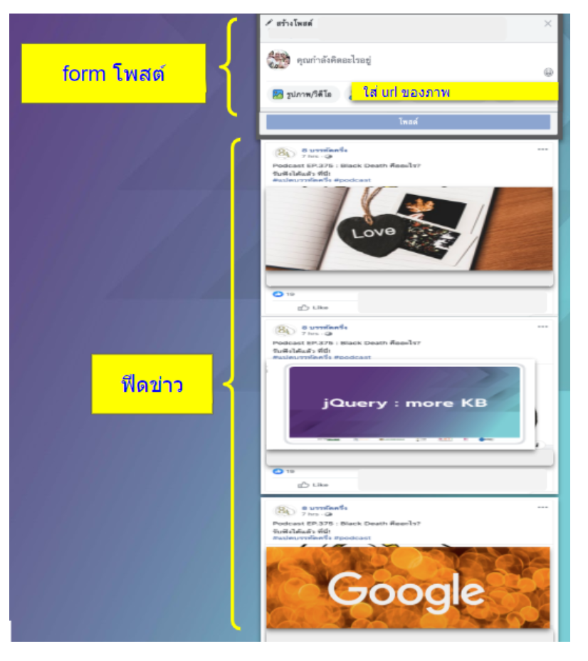
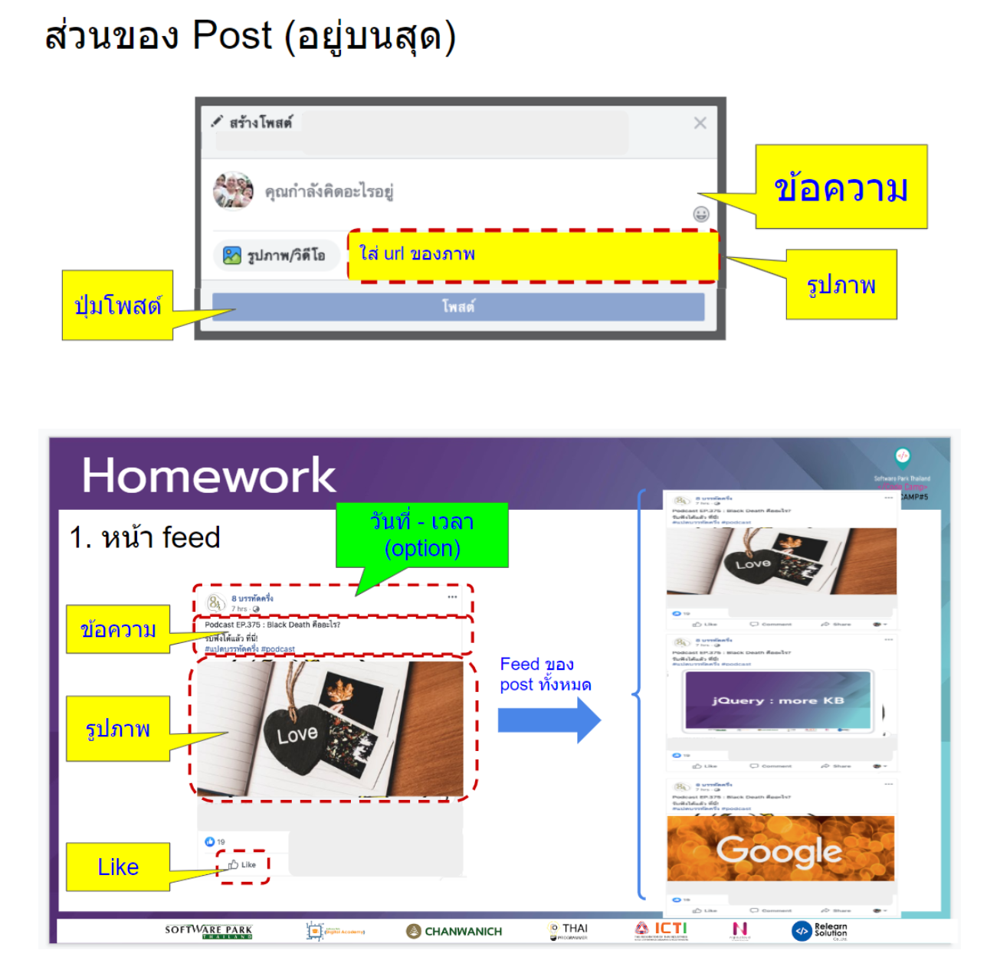

# Homework 6.JQuery

1. ทำ Post คล้ายแบบ facebook ด้วย jQuery
    -   แบบฟอร์มสร้าง post แล้วไปเพิ่มที่ feed ด้านล่าง
	-   โพสต์ล่าสุดให้อยู่ด้านบนสุดของฟีดข่าว
	-   แทรกรูปภาพในโพสต์ได้โดยใส่ url ของภาพ
	-   มีกด like ได้ในแต่ละโพสต์ (ที่อยู่ใน feed)

	*ส่งใน github.io ของตัวเอง
-   ใส่ในโฟลเดอร์ชื่อ jquery-hw 
-   [ชื่อ].github.io/jquery-hw

