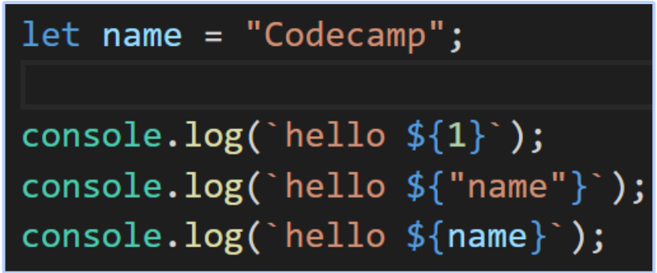
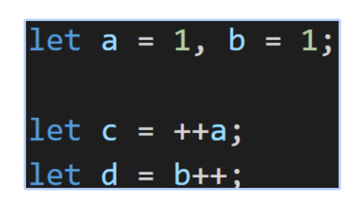
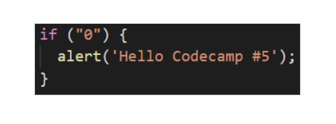
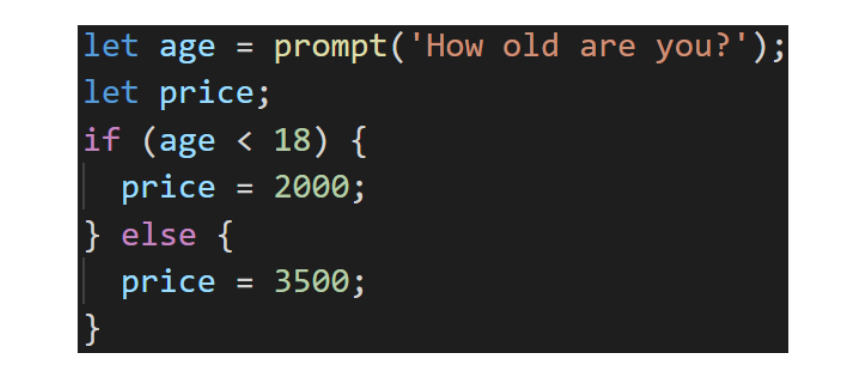

# Exercise Basic JavaScript - Part 1

1.  slide 41-42

    3.3.   ชื่อของตัวแปร (Exercise)
            -   c4mp
            -   _codecamp45
            -   _
            -   $code
            -   5codecamp
            -   codecamp#5
            -   code camp
            -   function1
            -   function
            -   if
            -   _if
            -   else
            -   codecamp-5
            -   โค๊ดแคมป์5

2.  slide 44-45

    3.4.   การตั้งชื่อตัวแปรที่ดี (Lab)

	        Lab 1
            -   ให้ประกาศตัวแปรชื่อ human และ name
            -   ใส่ชื่อตัวเองลงในตัวแปร name
            -   นำค่าที่อยู่ในตัวแปร name ไปใส่ให้ human 
            -   เมื่อ console.log(human) ออกมาต้องเป็นชื่อตัวเอง

            Lab 2
            -   ตั้งชื่อตัวแปรที่ใช้เก็บจำนวนเงินในกระเป๋าตังของคุณ
            -   ตั้งชื่อตัวแปรที่ใช้เก็บชื่อของ พ่อและแม่ของคุณ
            -   ตั้งชื่อตัวแปรที่ใช้เก็บที่อยู่ของบ้านคุณ
            -   ตั้งชื่อตัวแปรที่ใช้เก็บอายุของจักรวาล

3. slide 64-64

    ตัวแปรและประเภทของข้อมูล (Exercise 1)
    
    1.1.    ผลลัพธ์ทั้ง console.log ทั้งสามคืออะไร

        

    2.1. กำหนดตัวแปรสำหรับเก็บชื่อ และกำหนดค่าเริ่มต้นเป็นชื่อของผู้เรียน
    
    2.2. กำหนดตัวแปรสำหรับเก็บอายุ และกำหนดค่าเริ่มต้นเป็นอายุของผู้เรียน
    
    2.3. กำหนดตัวแปรสำหรับเก็บที่อยู่ และกำหนดค่าเริ่มต้นเป็นที่อยู่ของผู้เรียน
    
    2.4. กำหนดตัวแปรสำหรับเก็บประวัติของนักเรียนโดยใช้ตัวแปรทั้ง 3 ตัวด้านบนประกอบการเขียนประวัตินี้ด้วย

4. slide 94-95

    4.6. แบบฝึกหัด การดำเนินการเบื้องต้น

        1. ให้ระบุค่าของ a, b, c และ d หลังจากจบ statements ทั้งสามบรรทัด

            

        2. จงหาผลลัพธ์ของ Statement ต่อไปนี้
            -   "" + 1 + 0
            -   "" - 1 + 0
            -   true + false
            -   6 / "3"
            -   "2" * "3"
            -   4 + 5 + "px"
            -   "$" + 4 + 5
            -   "4" - 2
            -   "4px" - 2
            -   7 / 0
            -   "  -9  " + 5
            -   "  -9  " - 5
            -   null + 1
            -   undefined + 1
            -   " \t \n" - 2

5.  slide 118

    5.7.  การเปรียบเทียบ - แบบฝึกหัด

            จงหาค่าของการเปรียบเทียบต่อไปนี้
            -   5 > 4
            -   “apple” > “pineapple”
            -   “2” > “12”
            -   undefined == null
            -   undefined === null
            -   “bee” < “be”
            -   “bee” > “Bee”
            -   “Bee” < “be”

6. slide 133-136

    6.5.  แบบฝึกหัด

        1.  Browser จะโชว์ข้อความ “Hello Codecamp #5” ไหม

            

        2.  ใช้ if else ในการเขียนถามชื่อของคุณ
            -   ถ้าตอบถูกให้แสดงคำว่า “เก่งมาก”
            -   ถ้าตอบผิดให้แสดงคำว่า “คุณไม่รู้จักชื่อฉัน”

        3.  ใช้ prompt ในการรับคะแนนมาคำนวณเกรด
            -   ถ้าคะแนน มากกว่าเท่ากับ 80	ได้ A
            -   ถ้าคะแนน อยู่ระหว่าง 70 - 79 	 ได้ B
            -   ถ้าคะแนน อยู่ระหว่าง 60 - 69 	 ได้ C
            -   ถ้าคะแนน อยู่ระหว่าง 50 - 59 	 ได้ D
            -   ถ้าคะแนน น้อยกว่า 50		    ได้ F

        4.  เปลี่ยน if-else ข้างล่างในอยู่ในรูปของ Ternary Operators

            

